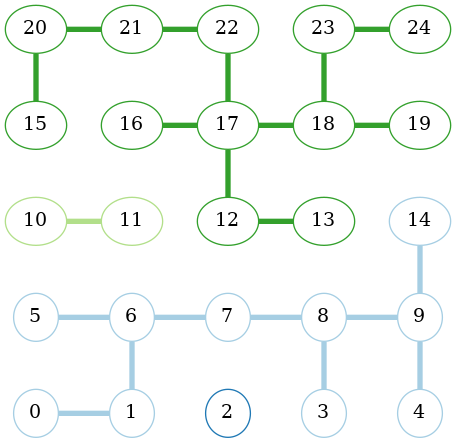

# TP_graphe

## Description

Ce TP2 consiste à créer aléatoirement un graphe non orienté à partir d'une grille de taille n x n, chaque point étant un sommet du graphe. Deux sommets adjacents (qui se touchent) peuvent (aléatoirement) être reliés par une arête. Le graphe est ensuite colorié selon les différentes composantes connexes. Le nombre de couleurs utilisées est affiché. Le graphe est ensuite affiché dans une fenêtre graphique grace à la bibliothèque graphique graphviz.



## Compilation

Pour compiler le programme, il suffit de taper la commande suivante dans un terminal :

```bash
make
```

## Utilisation

Pour lancer le programme, il suffit de taper la commande suivante dans un terminal :

```bash
./prog \[type execution] \[diagonale] \[option conditionnelle]
```
```

Par exemple :

```bash
./prog 1 5 true 0.55
```

## Type d'exécution

Le type 1 permet de génerer un graphe aléatoire et de le colorier, selon trois paramètres :
- la taille de la grille 
- la diagonale, qui correspond à true si on veut que les sommets de la diagonale puissent être reliés entre eux, false sinon
- l'option conditionnelle qui correspond à la probabilité qu'une arête soit créée entre deux sommets adjacents

Le type 2 permet de calculer la moyenne du nombre de parties connexes, selon trois paramètres :
- la taille de la grille
- la diagonale, qui correspond à true si on veut que les sommets de la diagonale puissent être reliés entre eux, false sinon
- l'option conditionnelle qui correspond à la probabilité qu'une arête soit créée entre deux sommets adjacents

Le type 3 permet de calculer la probabilité optimale pour obtenir un nombre de parties connexes donné, selon trois paramètres :
- la taille de la grille
- la diagonale, qui correspond à true si on veut que les sommets de la diagonale puissent être reliés entre eux, false sinon
- le nombre de parties connexes souhaité


